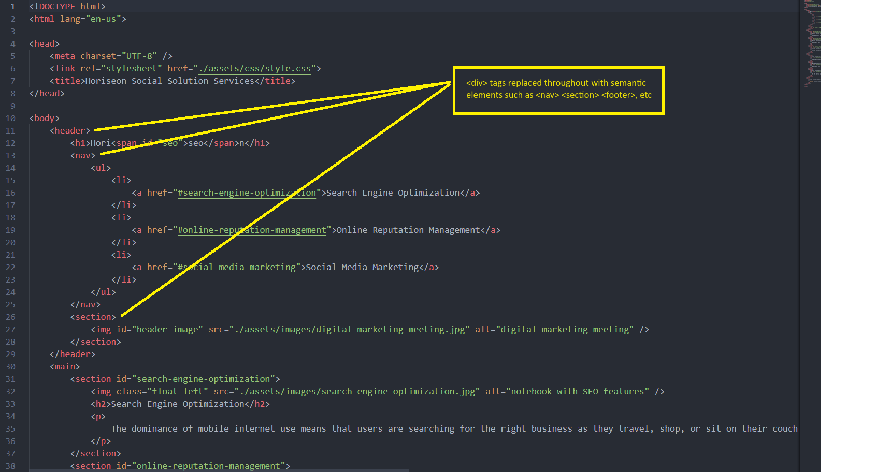

# Code Refactor Starter Code

## Description

The intent of this project is to refactor the existing and functional HTML into acceptable standards for semantics and thus 'Accessability'.
Screen readers, etc, will now be able to read through the HTML for those with accessability issues.
I've learned that Divs are to be mostly avoided and replaced with 'Semantic Elements' such as 'header', 'section', 'aside', etc.

## Installation

Repository location:        https://github.com/harrymac1972/m1_challenge.git

In Git Bash please type use:    git clone https://github.com/harrymac1972/m1_challenge.git    once in your folder of choice

## Usage

## Credits

Resources:

    https://www.w3schools.com/html/html5_semantic_elements.asp

    https://www.codecademy.com/resources/blog/semantic-html/

